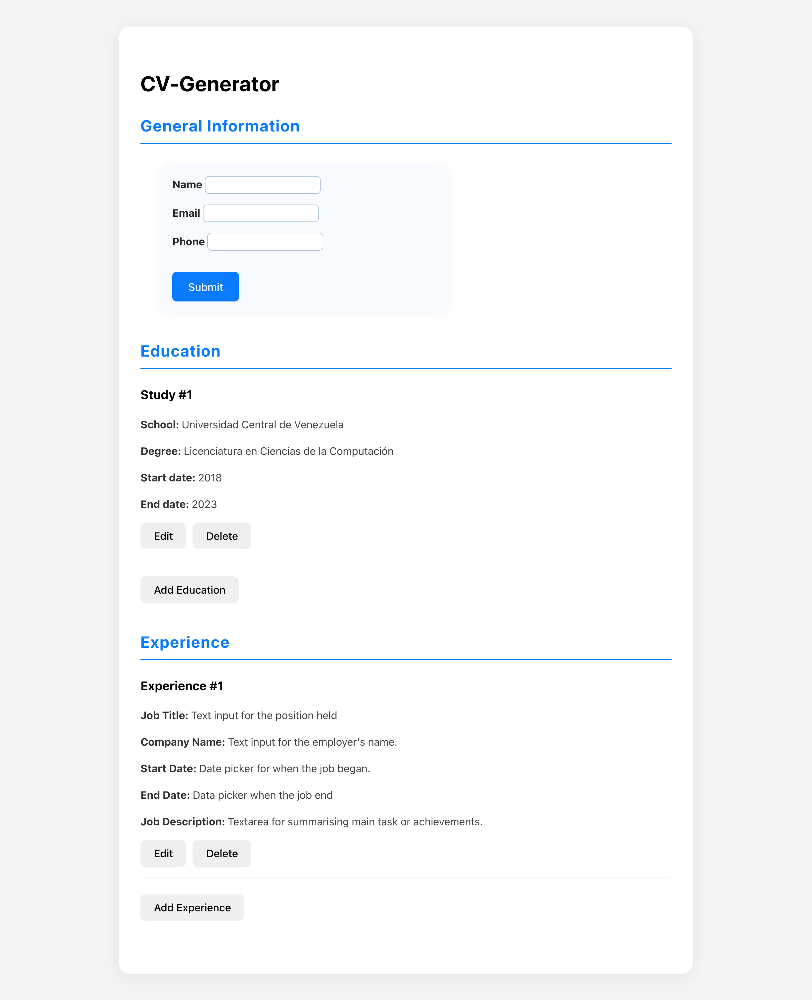

# CV Generator Application

An interactive web application built with React to dynamically create, edit, and preview a curriculum vitae. This project was developed as part of the React curriculum of **[The Odin Project](https://www.theodinproject.com/)**.

### ✨ [View Live Demo](https://andres-dev-react-cv-generator.netlify.app/) ✨



## 🚀 About the Project

The goal of this project is to apply core React concepts to build a fully functional application from scratch. It allows users to enter their personal, educational, and work experience information through interactive forms and preview the result in real-time.

## 🛠️ Main Features

- **General Information Section:** Add and edit your name, email, and phone number.
- **Dynamic Education and Experience Sections:**
  - **Create:** Add new study or job entries through a modal.
  - **Read:** View all entries in a clear and organized list.
  - **Update:** Edit any existing entry directly from the interface.
  - **Delete:** Remove entries you no longer need.
- **Modern User Interface:** Uses modals for a clean user experience when filling forms, avoiding page reloads or content jumps.
- **Real-Time Rendering:** All changes are instantly reflected in the CV preview.

## 💻 Built With

- **[React](https://react.dev/)** – Core library for building the user interface.
- **[Vite](https://vitejs.dev/)** – Next-generation development and build tool.
- **JavaScript (ES6+)** – Client-side logic.
- **CSS3** – Custom styling using Flexbox and CSS variables for a responsive and maintainable layout.

## 🧠 Key Concepts Learned

This project provided deep immersion into the React ecosystem, reinforcing concepts such as:

- **Component-Based Architecture** – Breaking the UI into reusable pieces.
- **State Management (`useState`)** – Handling local and complex state (objects and arrays).
- **Props** – One-way data flow from parent to child components.
- **Lifting State Up** – Centralizing shared state in the closest common ancestor.
- **Conditional Rendering** – Toggling between view/edit modes and showing modals.
- **List Rendering and `keys`** – Efficiently mapping data arrays to UI elements.
- **Controlled Components** – Managing forms with React as the single source of truth.
- **React Portals (`createPortal`)** – Rendering modals outside the main DOM hierarchy to avoid styling issues.

## 🏁 Getting Started

To run this project locally, follow these steps:

1. Clone the repository:
    ```bash
    git clone https://github.com/AndresDev28/cv-generator-react
    ```

2. Navigate to the project directory:
    ```bash
    cd your-repository
    ```

3. Install the dependencies:
    ```bash
    npm install
    ```

4. Start the development server:
    ```bash
    npm run dev
    ```

Then open [http://localhost:5173](http://localhost:5173) (or the port shown in your terminal) in your browser.
